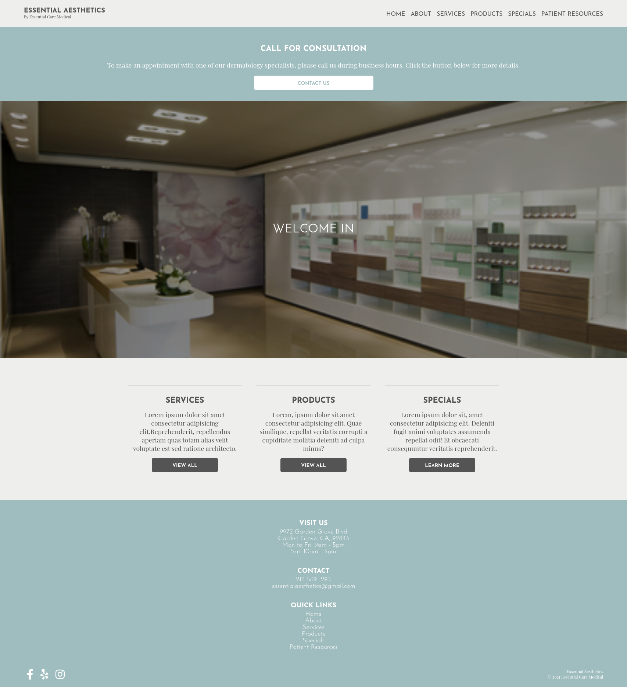

# Essential Aesthetics

## Table of Contents
- [Introduction](#introduction)
- [Demo](#demo)
- [Features](#features)
- [License](#license)

## Introduction
Essentials Aesthetics is a dynamic dermatology website using HTML, CSS, and vanilla JavaScript.  This project explores the use of BEM for naming conventions, utilizes session storage to load current and previously selected items, and dynamically loads products through JavaScript.  

## [Demo](https://atia009.github.io/essential-aesthetics/)

## Features
- Search bar for items
- Filter products by price and name
- Navigate through different brands via breadcrumb links 

## License
- [MIT License](https://badges.mit-license.org)
- Copyright 2022 @ Aaron Tia